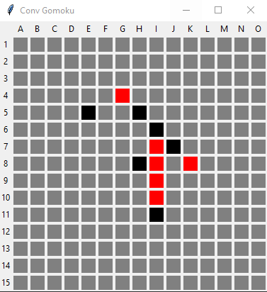
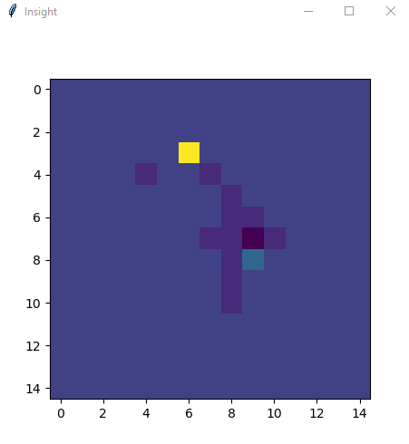

# Convolution-Gomoku
The Demonstration of A Convolution-based Gomoku Game State Evaluation Algorithm.

---

### The Paper:

https://www.worldscientific.com/doi/abs/10.1142/S0129626418500111

Yan, P., & Feng, Y. (2018). Using Convolution and Deep Learning in Gomoku Game Artificial Intelligence. *Modern Physics Letters A*, *28*(03), 1850011.

```bibtex
@article{yan2018using,
  title={Using Convolution and Deep Learning in Gomoku Game Artificial Intelligence},
  author={Yan, Peizhi and Feng, Yi},
  journal={Modern Physics Letters A},
  volume={28},
  number={03},
  pages={1850011},
  year={2018},
  publisher={World Scientific}
}
```

---

***please use python3 to run main.py***

> Screen-shots:
>
> #### The Game Interface (red: AI, black: user)
>
> 
>
> #### The Value Map (the AI uses this map to make decision)
>
> 


Last modified: Nov./12/2020